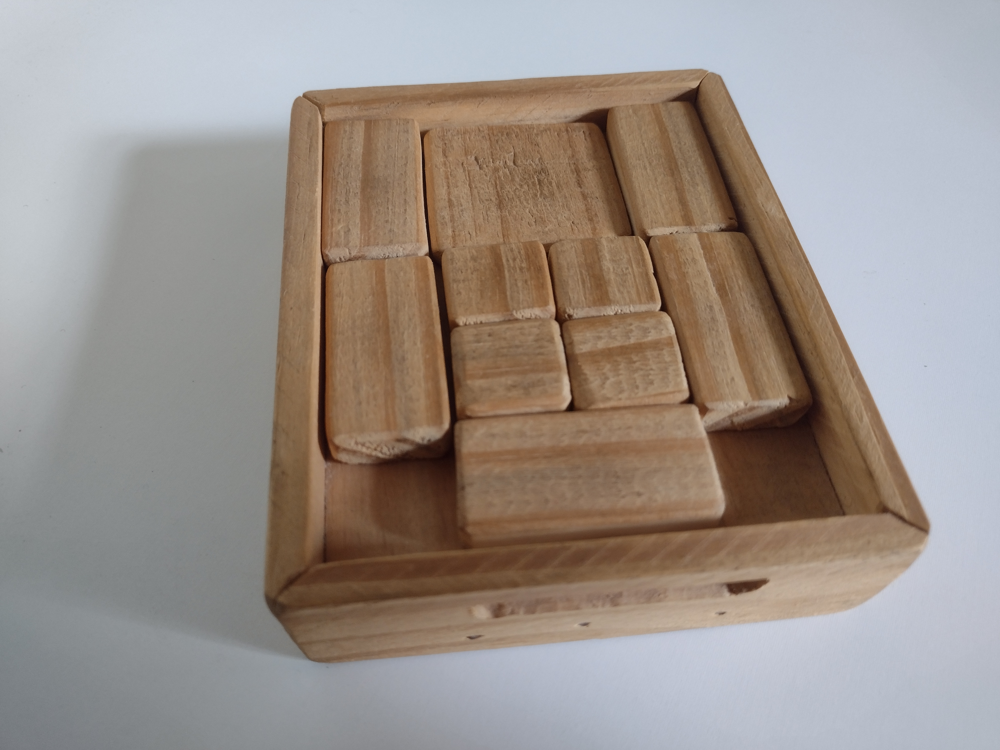
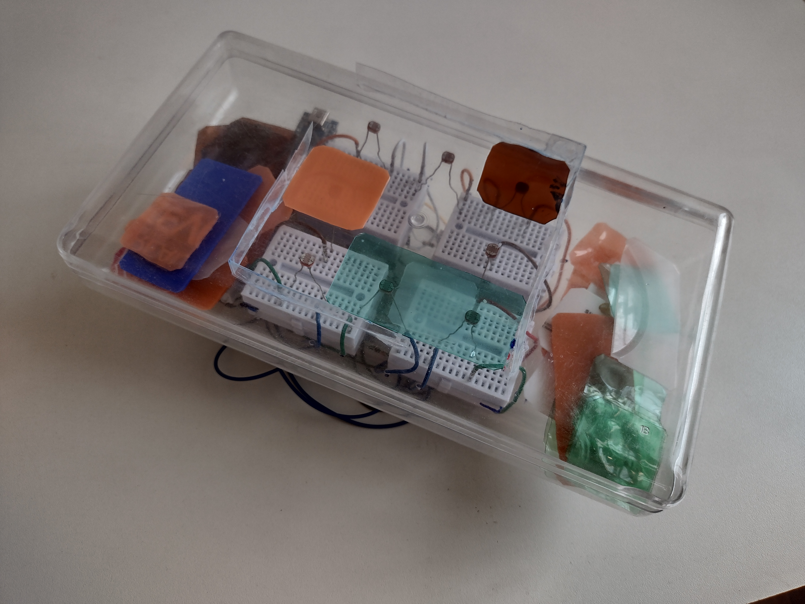

# caminhooculto
Development started during [SomaRumorII](http://www.artes.uff.br/somarumor/II/en/) sound art residence. It's still in develompent.

caminhooculto is a sculpture inspired by a old game with the same name ([Caminho Oculto](https://duckduckgo.com/?q=caminho+oculto+jogo&t=brave&iax=images&iai=https%3A%2F%2Fimg.elo7.com.br%2Fproduct%2Fmain%2F294FA7A%2Fcaminho-oculto-em-madeira-memoria.jpg&ia=images)). In this game your objective is to free the biggest piece of the game only by moving the quadrilateral pieces of diferent formats (the image bellow shows the starting position of the game's pieces and the piece 2 must be moved to where the pieces 9 and 10 are). 

The sculpture was planned to retain most of the game's characteristics but change the game's objective, which becomes generating visual patterns with the quadrilateral pieces that activate process of audio synthesis and processing, with a code developed in [SuperCollider](https://supercollider.github.io/).

For that, the sculpture uses 8 LDRs (light dependent resistors) and plastic pieces of different colors and transparency levels, cut also in quadrilateral formats. The plastic pieces allow the control of the luminosity valeus measured by the LDRs. Those values are then used to identify the visual patterns formed with the quadrilateral plastic pieces as well as to control the sound processes programmed.

The code developed, besides being responsible for the sounds, has a huge role in the gamming aspect of the project, recycling from time to time the possible patterns and their related processes, forcing a constant interaction with the sculpture in a search for new visual patterns and the sound manipulation.

This project is deticated to my grandfather, that loves playing Caminho Oculto, was the one who showed me this game and laughed at me many times before I could solve it.